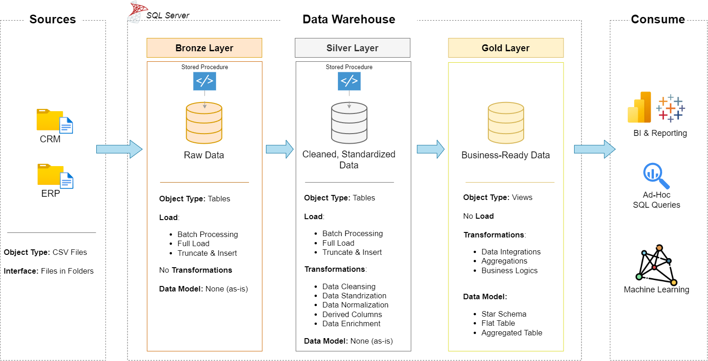
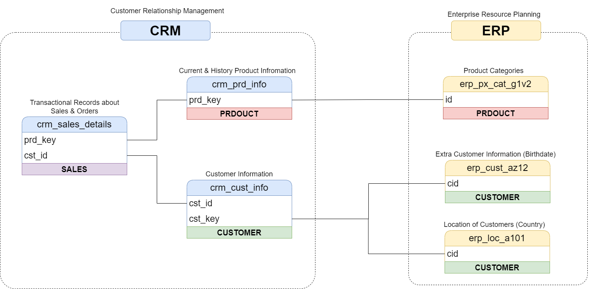
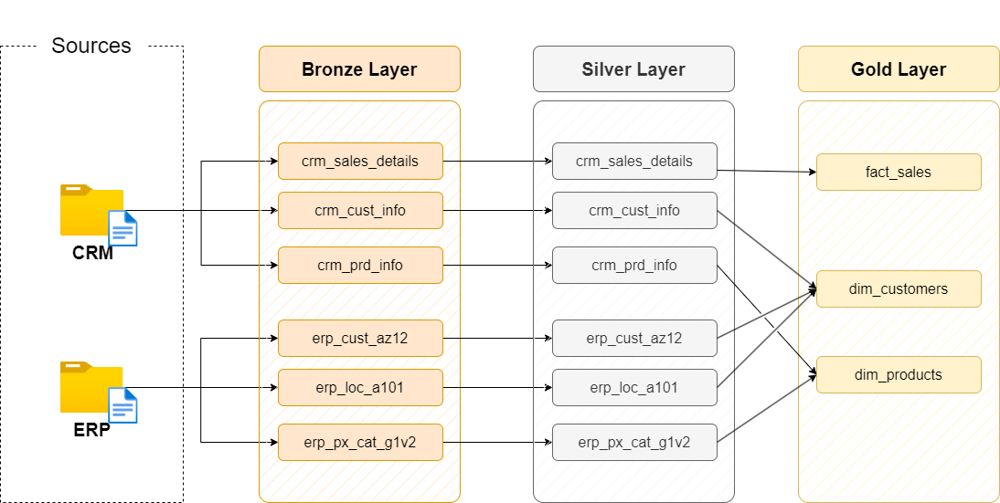
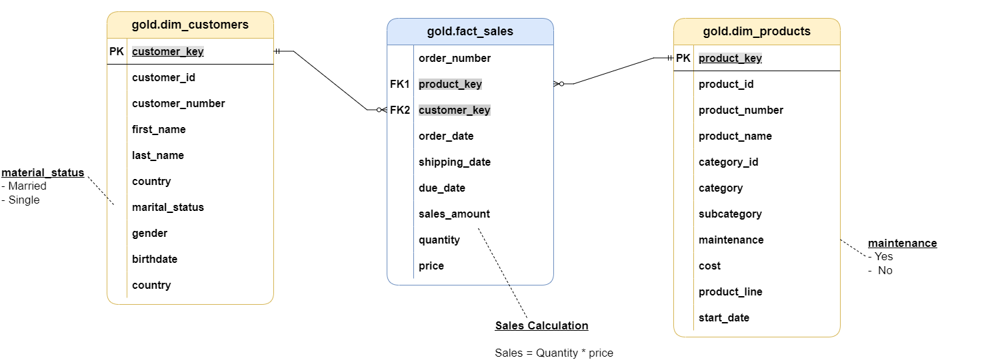

# 🚀 SQL Data Warehouse Project

## 📖 Overview

This project demonstrates the design and implementation of an end-to-end Data Warehouse using Microsoft SQL Server.

The solution integrates CRM and ERP data from CSV files, applies data cleansing and transformation rules, and delivers business-ready datasets through a Medallion Architecture consisting of Bronze, Silver, and Gold layers.

The project follows modern Data Engineering and Data Warehousing best practices, including:

- ETL Development
- Data Quality Management
- Data Cleansing & Standardization
- Dimensional Modeling
- Star Schema Design
- Surrogate Key Generation
- Business Rule Implementation
- Error Handling & Monitoring

---

# 🏗️ Architecture

## Medallion Architecture


---

# 📂 Data Sources


The warehouse integrates data from two business systems.

## CRM System

Contains:

- Customer Information
- Product Information
- Sales Transactions

### Tables

```text
crm_cust_info
crm_prd_info
crm_sales_details
```

---

## ERP System

Contains:

- Customer Master Data
- Product Categories
- Location Information

### Tables

```text
erp_cust_az12
erp_loc_a101
erp_px_cat_g1v2
```

---
## 🔄 Data Flow Diagram


# 🥉 Bronze Layer

## Purpose

Stores raw source data exactly as received from source systems.

## Characteristics

- Raw Data Storage
- No Transformations
- Full Load Processing
- Truncate & Insert Strategy
- CSV File Ingestion

## Tables

```text
bronze.crm_cust_info
bronze.crm_prd_info
bronze.crm_sales_details
bronze.erp_cust_az12
bronze.erp_loc_a101
bronze.erp_px_cat_g1v2
```

## Loading Method

```sql
EXEC bronze.load_bronze;
```

### Features

- BULK INSERT
- Batch Processing
- ETL Logging
- Error Handling

---

# 🥈 Silver Layer

## Purpose

Transforms raw data into clean and standardized datasets.

## Tables

```text
silver.crm_cust_info
silver.crm_prd_info
silver.crm_sales_details
silver.erp_cust_az12
silver.erp_loc_a101
silver.erp_px_cat_g1v2
```

## Loading Method

```sql
EXEC silver.load_silver;
```

---

## Data Cleansing

### Duplicate Removal

Keeps the latest customer record.

```sql
ROW_NUMBER() OVER (
PARTITION BY cst_id
ORDER BY cst_create_date DESC
)
```

---

## Gender Standardization

| Source | Standardized |
|----------|------------|
| M | Male |
| F | Female |

---

## Marital Status Standardization

| Source | Standardized |
|----------|------------|
| M | Married |
| S | Single |

---

## Country Standardization

| Source | Standardized |
|----------|------------|
| US | United States |
| USA | United States |
| DE | Germany |

---

## Data Quality Checks

### Customer Validation

```sql
WHERE cst_id IS NOT NULL
```

### Birthdate Validation

```sql
WHEN bdate > GETDATE()
THEN NULL
```

### Date Validation

```sql
WHEN sls_order_dt = 0
THEN NULL
```

---

## Sales Validation

Business Rule:

```sql
Sales = Quantity * Price
```

Incorrect sales values are automatically recalculated.

---

# 🥇 Gold Layer

## Purpose

Provides business-ready datasets optimized for analytics and reporting.

Implemented as SQL Views.

---

## ⭐ Star Schema

## Fact Table

### fact_sales

Stores transactional sales information.

| Column |
|----------|
| order_number |
| product_key |
| customer_key |
| order_date |
| shipping_date |
| due_date |
| sales_amount |
| quantity |
| price |

---

## Dimension Table

### dim_customers

| Column |
|----------|
| customer_key |
| customer_id |
| customer_number |
| first_name |
| last_name |
| gender |
| marital_status |
| birthdate |
| country |

---

## Dimension Table

### dim_products

| Column |
|----------|
| product_key |
| product_id |
| product_number |
| product_name |
| category |
| subcategory |
| maintenance |
| cost |
| product_line |
| start_date |

---

# 🔑 Surrogate Keys

Generated using:

```sql
ROW_NUMBER() OVER(...)
```

Examples:

```sql
customer_key
product_key
```

Benefits:

- Improved Query Performance
- Stable Relationships
- Data Warehouse Best Practice

---

# 🔄 Slowly Changing Dimension Logic

Product history tracking is implemented using:

```sql
LEAD(prd_start_dt)
```

End dates are automatically calculated.

Only active products are loaded into Gold.

```sql
WHERE prd_end_dt IS NULL
```

---

# ⚙️ ETL Pipeline

## Step 1: Load Bronze Layer

```sql
EXEC bronze.load_bronze;
```

### Responsibilities

- Load CSV Files
- Truncate Existing Data
- Store Raw Data

---

## Step 2: Load Silver Layer

```sql
EXEC silver.load_silver;
```

### Responsibilities

- Data Cleansing
- Data Standardization
- Data Validation
- Data Enrichment

---

## Step 3: Query Gold Layer

```sql
SELECT *
FROM gold.fact_sales;
```

---

# 📊 Business Calculations

## Revenue

```sql
SUM(sales_amount)
```

## Total Orders

```sql
COUNT(order_number)
```

## Quantity Sold

```sql
SUM(quantity)
```

## Average Order Value

```sql
AVG(sales_amount)
```

---

# 🛡️ Error Handling

Implemented using:

```sql
BEGIN TRY

-- ETL Logic

END TRY

BEGIN CATCH

-- Error Logging

END CATCH
```

Benefits:

- Robust ETL Process
- Easier Debugging
- Better Reliability

---

# ⏱️ ETL Monitoring

Execution times are tracked using:

```sql
DATEDIFF(
SECOND,
@start_time,
@end_time
)
```

Tracks:

- Table Load Duration
- Batch Duration
- ETL Performance

---

# 📈 Analytics Capabilities

The Data Warehouse supports:

## Sales Analytics

- Revenue Analysis
- Sales Trends
- Order Analysis

## Customer Analytics

- Customer Segmentation
- Demographic Analysis
- Country Analysis

## Product Analytics

- Product Performance
- Category Analysis
- Cost Analysis

---

# 📊 Reporting & BI

The Gold Layer is designed for:

- Power BI Dashboards
- Ad-Hoc SQL Queries
- Executive Reporting
- KPI Monitoring

Example Dashboards:

- Sales Dashboard
- Customer Dashboard
- Product Dashboard
- Executive Dashboard

---

# 🚀 Future Enhancements

Potential improvements include:

- Incremental Loading
- Change Data Capture (CDC)
- Time Dimension
- Geography Dimension
- SQL Server Agent Scheduling
- Azure Data Factory Integration
- Machine Learning Pipelines

---

# 🛠️ Technologies Used

- Microsoft SQL Server
- T-SQL
- Stored Procedures
- BULK INSERT
- Star Schema
- Dimensional Modeling
- Medallion Architecture
- Power BI

---

# 📚 Skills Demonstrated

### Data Warehousing

- Medallion Architecture
- Star Schema
- Fact & Dimension Modeling
- Surrogate Keys

### Data Engineering

- ETL Development
- Data Integration
- Data Transformation
- Data Quality Management

### SQL Development

- Stored Procedures
- Window Functions
- Views
- Error Handling

### Business Intelligence

- KPI Development
- Reporting Models
- Analytical Data Design

---

# 🎯 Project Outcomes

✅ Built a complete SQL Server Data Warehouse

✅ Integrated CRM and ERP systems

✅ Implemented Bronze, Silver, and Gold layers

✅ Developed automated ETL pipelines

✅ Applied data quality and validation rules

✅ Created a Star Schema dimensional model

✅ Enabled BI reporting and analytics

✅ Prepared data for future Machine Learning workloads

---

## 👨‍💻 Author

**Purva Kalamabte**  
B.Tech – Electronics & Communication (ENC) Engineering  

- 🎓 Bachelor of Technology in Electronics & Communication Engineering  
- 🏆 Qualified **GATE 2025** with **AIR 8067**  
- 📄 Published **2 Research Papers** in Machine Learning (CNN-based Models)  
- 💡 Interested in Data Engineering, Machine Learning, and Data Analytics  
- 🛠️ Skilled in SQL Server, T-SQL, Data Warehousing, ETL Development, Python, PowerBI, Excel  

---

